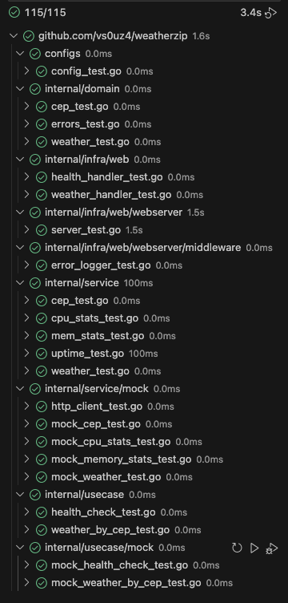
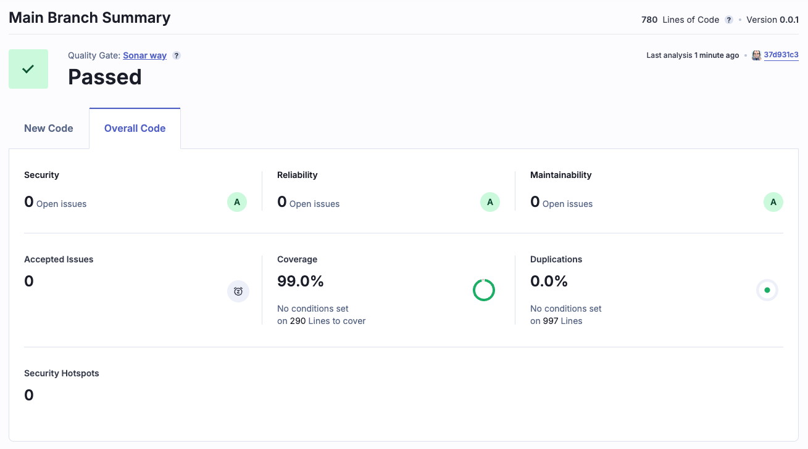

# WeatherZip

> [!IMPORTANT]
> Para poder executar o projeto contido neste repositório é necessário que se tenha o Go instalado no computador. Para maiores informações siga o site <https://go.dev/>

- [WeatherZip](#weatherzip)
  - [Desafio GoLang Pós GoExpert - Deploy com Cloud Run](#desafio-golang-pós-goexpert---deploy-com-cloud-run)
    - [Requisitos a serem seguidos](#requisitos-a-serem-seguidos)
      - [Entregas](#entregas)
    - [Extras Adicionados](#extras-adicionados)
      - [Suite de Testes com SonarCloud](#suite-de-testes-com-sonarcloud)
    - [Executando o Serviço](#executando-o-serviço)
    - [Informações da API](#informações-da-api)
      - [Rotas](#rotas)
      - [Consultando Temperaturas](#consultando-temperaturas)
      - [Exemplo de Respostas](#exemplo-de-respostas)

## Desafio GoLang Pós GoExpert - Deploy com Cloud Run

Este projeto faz parte da Pós GoExpert como desafio, nele são cobertos os conhecimentos em http webserver, APIRest, Viper, channels, tratamentos de erros, packages, Clean Architecture, DI, Swagger, Cloud Run, Deploy

O Desafio consiste em desenvolver e realizar o `deploy` de uma API, que tenha um `endpoint` onde possamos informar um `cep` e através deste, identificarmos a localidade/cidade e retornarmos a temperatura atual desta localidade em três escalas termométricas, sendo elas:

- Celsius;
- Fahrenheit;
- Kevin

> Esta API deverá ser publicada no Google Cloud Run.

### Requisitos a serem seguidos

- Deve receber um CEP válido de 8 dígitos;
- Deve realizar a pesquisa de CEP, encontrando a localidade e a partir disso retornar as temperaturas formatadas, nas escalas temométricas: Celsius, Fahrenheit e Kelvin;
- Deve responder de forma adequada aos seguintes cenário:
  - No caso de **SUCESSO**:
    - Código HTTP: 200
    - Response Body: { "temp_C": 28.5, "temp_F": 28.5, "temp_K": 28.5 }
  - Em caso de **FALHA**, onde o CEP não seja válido (formato incorreto)
    - Código HTTP: 422
    - Response: Invalid Zipcode
  - Em caso de **FALHA**, onde o CEP informado não seja encontrado
    - Código HTTP: 404
    - Response: Can`t find Zipcode
- Deve ser realizado o `deploy` da aplicação no Google Cloud Run.

> [!TIP]
> Algumas dicas para ajudar no desenvolvimento
>
> - Utilizar serviço de API como [viaCEP](https://viacep.com.br/) ou similar para encontrar a localidade através do **CEP** informado;
> - Uilizar serviço de API como [WeatherAPI](https://www.weatherapi.com/) para consultar as temperaturas atuais da localidade;
> - Fórmula para conversão: Celsius > Fahrenheit (`F = C * 1,8 + 32`)
> - Fórmula para conversão: Celsius > Kelvin (`K = C + 273`)
>
>
> Sendo as letras _F_, _C_ e _K_ respectivamente o seguinte:
>
> - C = _Celsius_;
> - F = _Fahrenheit_;
> - K = _Kelvin_

#### Entregas

- Código-fonte completo da implementação;
- Testes automatizados demonstrando o funcionamento;
- Dockerfile e Docker Compose para execução e validação da aplicação;
- Deploy no Google Cloud Run (free tier) com endereço ativo.

### Extras Adicionados

Como sempre gosto de buscar incrementar meus exercícios, aumentando assim as chances de aprender mais, implementei um `endpoint` extra a nossa API
onde teremos todo um retorno para sabermos a saúde de nosso serviço/servidor, o famoso `health check`. O mesmo atenderá no seguinte endereço abaixo:

```http
http://localhost:8080/health
```

E terá como resposta um `payload` bem rico, contendo informações sobre:

- Uso de cpu;
- Uso de memória;
- Horário do servidor;
- Tempo de funcionamento;
- Tempo da requisição.

> [!WARNING]
> Devido a particularidades de algumas `cloud providers` pode ser que algumas estatísticas não sejam apresentadas ou
> apresentem-se zeradas.

Abaixo segue um exemplo de como será disponibilizado o `payload` na API

```json
{
    "cpu": {
        "cores": 4,
        "percent_used": [
            37.7,
            34.1,
            30,
            26.7,
        ]
    },
    "memory": {
        "total": 17179869184,
        "used": 13563052032,
        "free": 153239552,
        "available": 3616817152,
        "percent_used": 78.9
    },
    "uptime": "4.990172625s",
    "duration": "342.917µs",
    "status": "pass",
    "message": "Alive and kicking!",
    "time": "2024-12-10T16:56:00-03:00"
}
```

> [!TIP]
> Alguns pontos a serem destacados sobre o Health Check
>
> Caso ocorra falha na obtenção de informações, sejam elas de CPU ou Memória seus respectivos dados serão informados como vázio
> o `status` será retornado como `fail` e o campo `message` será exibido como `Still alive, but not kicking!`, caso contrário todas
> as informações irão preenchidas e o `status` e `message` serão retornados conforme o modelo apresentado logo acima.

Além do `health_check` todo o projeto do desafio foi coberto por testes e passou pelo SonarCloud, para isto foi implementado uma CI onde executamos os seguintes passos:

- Lint;
- Testes;
- SonarCloud;
- Checagem de Vulnerabilidades;
- Build Multi-OS.

#### Suite de Testes com SonarCloud

Para executar a suite de testes do projeto, estando na pasta raiz do projeto, basta executar os seguintes comando:

- Rodar suite de testes

```shell
❯ go test -v ./... -coverprofile=reports/coverage.out
```



> A suite de testes será executada e um relatório de cobertura será gerado na pasta `reports`

- Gerar sumário de taxas de cobertura

```shell
❯ go tool cover -func=coverage.out
```



### Executando o Serviço

- Inicializando o serviço...

Para executar o sistema, basta executarmos o seguinte comando abaixo:

```shell
❯ docker-compose up
```

Na janela do terminal, você deverá ver uma mensagem parecida com o exemplo abaixo:

```shell
❯ docker-compose up
[+] Running 1/0
 ✔ Container app  Created                                                                                                                                            0.0s 
Attaching to app
app  | Starting web server on port :8080
```

- Encerrando o serviço

Para encerrar os serviços, estando no modo de execução atachado, bastar que pressionemos `Ctrl+C` e o processo de encerramento dos containers se iniciará imediatamente, ao fim do processo você deverá ver em sua janela de terminal algo parecido com o exemplo abaixo:

```shell
^CGracefully stopping... (press Ctrl+C again to force)
[+] Stopping 1/1
 ✔ Container app  Stopped                                                                                                                                            0.1s 
canceled
```

### Informações da API

O serviço de API, quando rodando em ambiente local, irá responder no host `localhost` e na porta `8080`. Quando hospedada por padrão responde na porta padrão que é a porta `80`, porta a qual não precisamos especificar.

> [!NOTE]
> Esta API está hospedada na Google Cloud Run sob o domínio: https://weatherzipapp-p3moyldvkq-uc.a.run.app/

#### Rotas

As rotas disponíveis na API, foram apresentadas na listagem abaixo:

```plaintext
GET /               - rota raiz, exibe mensagem de saudação (enjoy the silence!);
GET /health         - Verificação de saúde do serviço e exibe algumas estatísticas;
GET /weather/{cep}  - Exibição de temperatura atual de uma localidade a ser consultada através do CEP.
```

#### Consultando Temperaturas

**Como consultamos a temperatura de uma determinada localidade?** \
Para consultar o clima de uma localidade, basta você consultar a API através da rota `weather` esteja ela sendo executada
localmente ou não, para ambos os casos basta acrescentarmos a URL base a rota a ser consultada. Exemplos

Em ambiente local
> http://localhost:8080/weather/98807172

Google Cloud Run
> https://weatherzipapp-p3moyldvkq-uc.a.run.app/weather/98807172

#### Exemplo de Respostas

- GET / - HTTP Status 200

```json
Enjoy the silence!
```

- GET /weather/98807172 - HTTP Status 200

```json
{
  "temp_C": 12.2,
  "temp_F": 54,
  "temp_K": 285.34999999999997
}
```

- GET /weather/988071722 - HTTP Status 422

```json
invalid zipcode
```

- GET /weather/24560352 - HTTP Status 404

```json
can not find zipcode
```

- GET /health - HTTP Status 200

```json
{
    "cpu": {
        "cores": 2,
        "percent_used": [
            0,
            0
        ]
    },
    "memory": {
        "total": 1073741824,
        "used": 1253376,
        "free": 1066659840,
        "available": 1066659840,
        "percent_used": 0.1
    },
    "uptime": "29.693959ms",
    "duration": "386.071µs",
    "status": "pass",
    "message": "Alive and kicking!",
    "time": "2024-12-13T13:52:52-03:00"
}
```